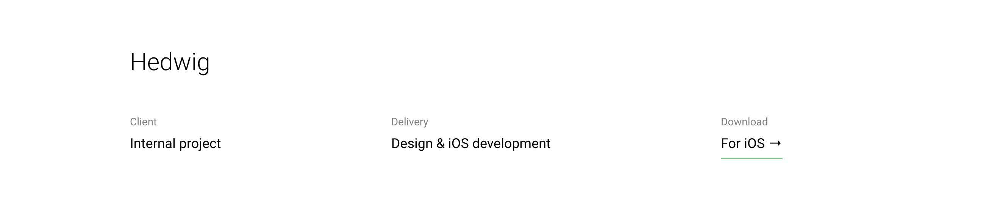

# Composants

| Contentful Name         | Component Name                | Component Image                                             | Image R (WxH)|
|:----------------------- |:-----------------------------:|:-----------------------------------------------------------:|--------------|
| Case Study Title        | `case-study-title`            |             |--------------|
| Case Study Text         | `case-study-text`             |               |--------------|
| Case Study Image        | `case-study-image`            |             | autoxauto    |
| Case Study Gif          | `case-study-gif`              |                 | 800xauto     |
| Case Study Blank Space  | `case-study-blank-space`      | |--------------|
